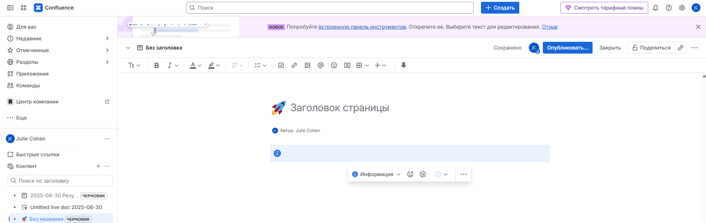
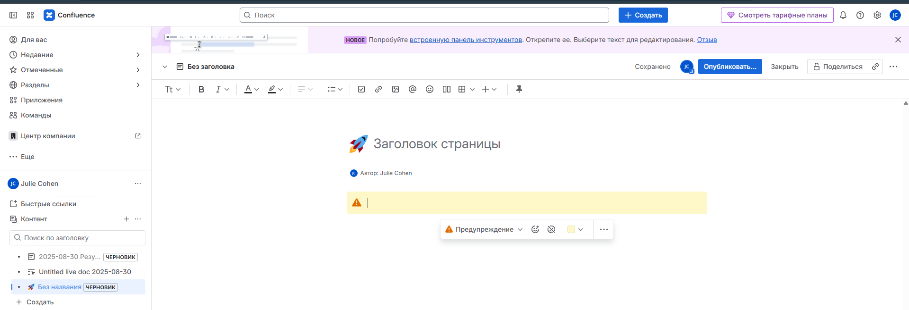
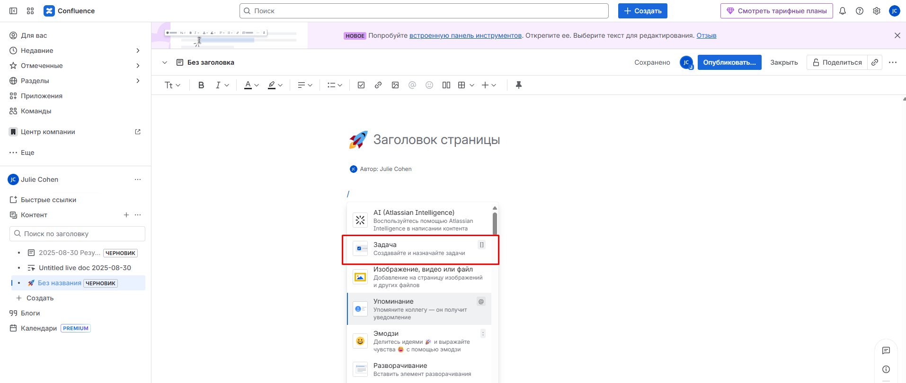

# Как этот гайд будет выглядеть в Confluence

В Confluence мы используем макросы для улучшения внешнего вида и функциональности гайда.

## 1. Блок "Важно" или "Предупреждение"

*   **В Markdown** мы использовали `{:.alert .alert-success}` (это CSS-классы, которые могут не сработать).
*   **В Confluence** используй макрос **`Info`** или **`Warning`**.
    *   Скриншот: 
    *   Скриншот: 

## 2. Чек-лист (Список дел)

*   **В Markdown:** `- [ ] Задача`.
*   **В Confluence** есть встроенный макрос **`Task List`**. Он создает интерактивные чекбоксы, которые можно отмечать.
    *   Скриншот: 

## 3. Диаграмма процесса (Mermaid)

*   **В Markdown** мы вставили код Mermaid в блок кода.
*   **В Confluence** нужно установить макрос **`Mermaid Diagrams`** из Marketplace. После установки просто вставь код Mermaid в макрос — он превратится в диаграмму.

## 4. Панели вкладок (Tabbed Content)

Чтобы не загромождать страницу, разделы "Неделя 1", "Неделя 2-3" и "Неделя 4" можно поместить в макрос **`Tabs`**.
Так новый сотрудник будет видеть только актуальную для него неделю.

---