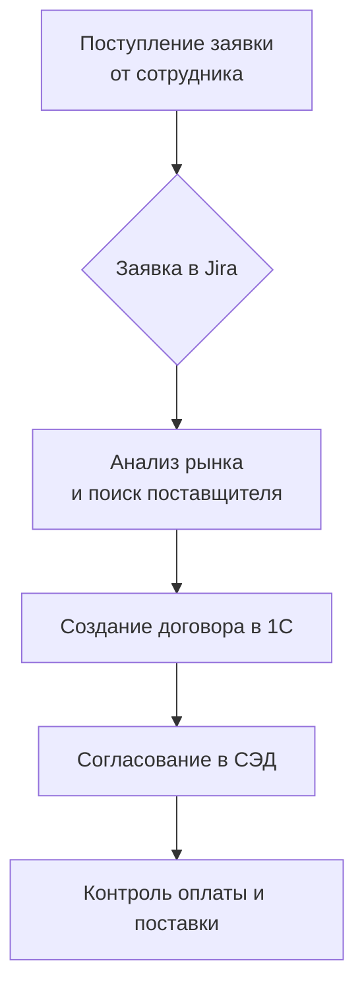

# 🚀 Онбординг-гайд для нового сотрудника отдела закупок

{:.alert .alert-success}
**Добро пожаловать в команду!** Это руководство поможет тебе освоиться в первые 30 дней. Сохрани эту страницу в закладки - она будет твоим лучшим другом на ближайший месяц.

---

## 📅 Неделя 1: Первые шаги и погружение в контекст

### День 1: Знакомство и настройка (./first-day-checklist.md)

**Задачи на день:**
*   [ ] **Встреча с HR и руководителем:** Узнай о целях отдела и своих ключевых задачах на испытательный срок.
*   [ ] **Настройка рабочего места:** Получи логины и доступы ко всем системам.
*   [ ] **Знакомство с командой:** Запланируй 10-минутные созвоны с каждым коллегой из своего отдела.
*   [ ] **Прочти этот гайд до конца:** Особенно раздел "Ключевые системы".

**Полезные ссылки:**
*   [Организационная структура компании](https://wiki.company.com/HR/OrgChart)
*   [Корпоративный кодекс](https://wiki.company.com/HR/Handbook)

### День 2-5: Изучение основ

**Ключевые системы, с которыми ты должен быть знаком:**

| Система | Для чего нужна | Где взять доступ |
| :--- | :--- | :--- |
| **1C:Управление торговлей** | Основная система для проведения закупок, формирования договоров и отчетов. | Заявка в IT через [ServiceDesk](https://sd.company.com) |
| **СЭД (СБИС/Диадок)** | Электронный документооборот. Согласование договоров, подписание ЭЦП. | Заявка в отдел делопроизводства |
| **База знаний Confluence** | Хранилище всех инструкций, регламентов и знаний отдела. | Доступ по умолчанию |
| **Jira** | Учет задач и workflow по закупкам. | Заявка в IT на добавление в проект `PROC` |

---

## 🏗 Неделя 2-3: Погружение в процессы

### Бизнес-процесс закупки "под ключ"

1.  **Инициация:** Получение заявки от сотрудника компании → Создание задачи в Jira.
2.  **Анализ рынка:** Поиск минимум 3-х поставщиков. Запрос КП (Коммерческих предложений).
3.  **Подготовка ТЗ:** Формулировка технических требований. *Важно: всегда согласовывай ТЗ с инициатором заявки.*
4.  **Выбор поставщика и заключение договора:**
    *   Создание договора в 1С на основе данных из КП.
    *   Согласование юристом и финансовым директором через СЭД.
    *   Подписание ЭЦП.
5.  **Контроль исполнения:** Отслеживание оплаты, получение оригинала закрывающих документов (акты, счета-фактуры).

### Важные документы и где их искать

*   **Договор:** Хранится в 1С и на сетевом диске `\\Server\Contracts\2025\`.
*   **Закрывающие документы (Акт, Счет-фактура):** Подшиваются в папку договора после оплаты.
*   **Коммерческие предложения:** Прикрепляются к задаче в Jira.

---

## 🧠 Неделя 4: Самостоятельная работа и менторинг

*   **Возьми свою первую небольшую закупку под полный контроль** (например, заказ канцелярии).
*   **Покажи результат ментору** перед тем как отправить договор на согласование.
*   **Запланируй финальную встречу с руководителем** для обратной связи по итогам первого месяца.

---

## ❓ Часто задаваемые вопросы (FAQ)

**В.: Куда обращаться по вопросам IT?**
**О.:** Создавай заявку в [ServiceDesk](https://sd.company.com) или пиши в telegram-чат `#it_support`.

**В.: Что делать, если поставщик задерживает доставку?**
**О.:** 1) Немедленно уведомить инициатора заявки. 2) Сообщить руководителю. 3) Совместно с юристами подготовить претензионное письмо.

**В.: Где взять шаблон рамочного договора?**
**О.:** Все актуальные шаблоны лежат в папке `\\Server\Contracts\Templates\`.

---
*Версия документа: 2.1. Дата последнего обновления: 25.08.2025. Автор: Юлия Минглиева.*

*Если ты обнаружил неточность или у тебя есть предложение по улучшению гайда — напиши мне в Telegram (@login) или создай задачу в Jira (PROC-123).*
